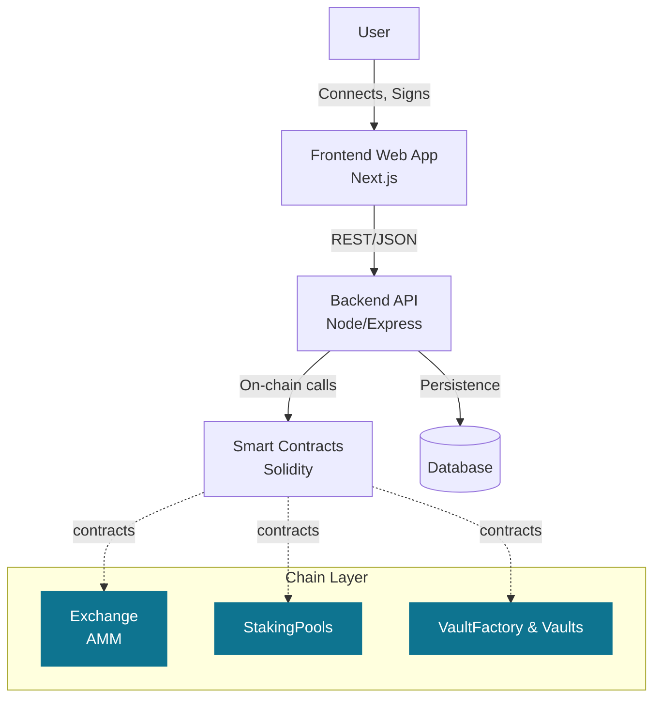
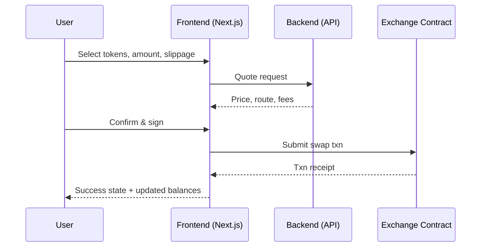
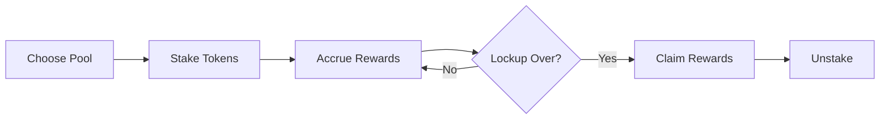

## Ingress — Unified On‑Chain Investing, Staking, and Swaps

Ingress is a modern, user‑friendly DeFi application that brings token swaps, yield‑earning vaults, and staking pools into a single, cohesive experience. It’s designed for everyday users who want transparent yields and fast, low‑fee transactions, and for institutions that need a clean, auditable flow for digital asset operations.

### Why Ingress

- **All‑in‑one**: Swap tokens, stake for rewards, and allocate into vaults in one place.
- **Fast and low‑cost**: Built with performance and low fees in mind.
- **Trust‑by‑design**: On‑chain smart contracts, verifiable rewards, and transparent accounting.
- **User‑centric**: Clear portfolio views, intuitive actions, and meaningful insights.

---

### What You Can Do

- **Swap tokens instantly**: Execute on‑chain swaps with a simple, familiar UX.
- **Stake for rewards**: Choose from multiple staking pools with clear APRs and lock terms.
- **Deposit into vaults**: Allocate stablecoins and tokens into strategy vaults for automated yield.
- **Track your portfolio**: See balances, positions, and transaction history in one dashboard.
- **Manage wallet & transfers**: Connect your wallet, move tokens, and view confirmations.

---

### Key Features at a Glance

- **Clean Dashboard**: High‑signal overview of holdings, allocated capital, and rewards.
- **Token Swap**: AMM‑style swapping with slippage controls and detailed transaction previews.
- **Staking Pools**: Multiple pools, time‑bound or flexible, with clear emissions and claim flows.
- **Vaults**: Stablecoin and token vaults for automated strategies and reward accrual.
- **Transaction History**: Human‑readable activity with statuses and references.
- **Security & Controls**: Non‑custodial architecture, audited patterns, and standard safeguards.

---

### High‑Level Architecture

---

### User Flow — Token Swap

---

### Staking Lifecycle Overview

---

### What’s Under the Hood

- **Frontend**: Next.js app with reusable UI components for dashboard, swaps, staking, vaults, wallet, and history.
- **Backend**: Node/Express API for quoting, orchestration, and secure off‑chain helpers.
- **Smart Contracts**: Solidity contracts for Exchange (AMM), StakingPools, VaultFactory, and RewardVault.
- **Data**: Backend persistence for user sessions, metadata, and indexing.

Repository highlights:

- `frontend/` — App routes, components, hooks, and chain utils
- `backend/` — API, controllers, services, and configuration
- `contract/` — Solidity sources, deployments, and scripts

---

### Screenshots (Placeholders)

- Dashboard: portfolio, balances, recent activity
- Swap: input/output, price impact, slippage
- Staking: pool cards, APRs, rewards, claim
- Vaults: deposit/withdraw, performance, allocations

Add assets under `frontend/public/` and reference them here.

---

### Who It’s For

- Individuals seeking straightforward yield across staking and vaults
- Power users who want AMM swaps + yield in one tab
- Teams needing clean, non‑custodial flows for treasury operations

---

### Roadmap (Excerpt)

- Wallet extensions and mobile‑first improvements
- Additional vault strategies and risk labels
- Advanced analytics: PnL, tax lots, and export
- Governance hooks and programmatic access keys

---

### Trust & Safety

- Non‑custodial by default; users control private keys
- Transparent on‑chain contracts and verifiable rewards
- Defense‑in‑depth patterns following established best practices

---

### For Developers (Brief)

- Frontend: Next.js app in `frontend/`
- Backend: Node/Express in `backend/`
- Contracts: Solidity in `contract/`

See folders above for code and deployment artifacts. This README focuses on the product story; engineering details live alongside the code.

---

### License

This project is provided under an open‑source license. See the repository for details.

---

### Contact

Questions or ideas? Open an issue or start a discussion in this repository.
