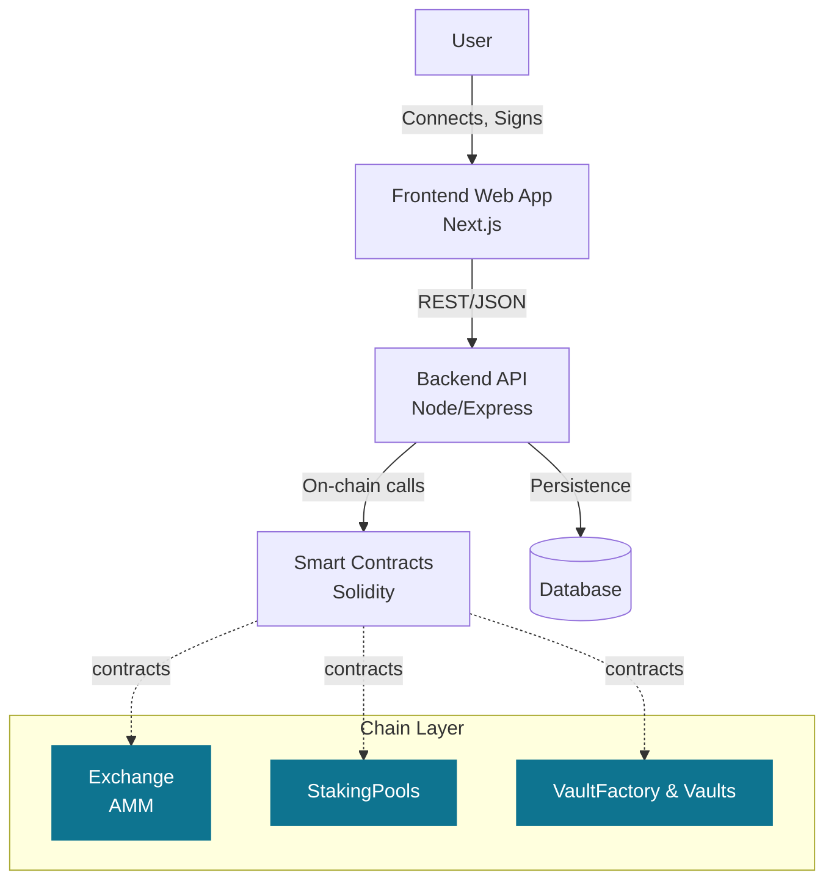
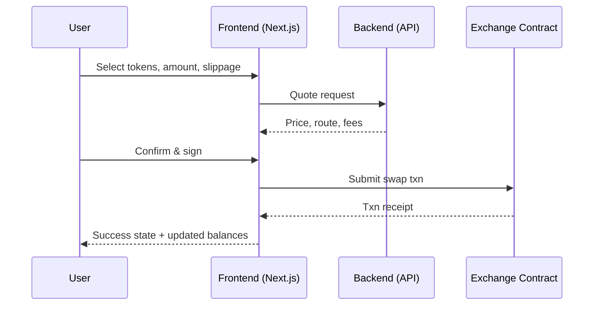
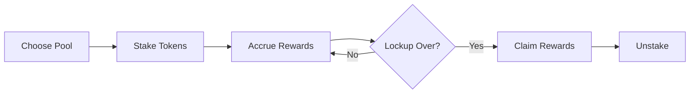

## Ingress — All‑In‑One Money App for the Unbanked

Ingress is the all‑in‑one money app for the unbanked. Send and swap Naira, buy and send USDT, and seamlessly bridge bank rails and crypto—then stake and invest for yield—in one secure, simple platform.

### Why Ingress

- **All‑in‑one Platform**: Swap assets, stake for rewards, and invest in yield strategies—all in one place.
- **Bridging Traditional and Crypto Finance**: Send and swap Naira, buy USDT, and seamlessly bridge bank rails with blockchain.
- **Fast and Low‑Cost**: Built with performance and low fees in mind on Hedera Hashgraph.
- **Trust‑by‑Design**: On‑chain smart contracts, verifiable rewards, and transparent accounting.
- **Democratized Access**: Sophisticated investment strategies accessible to everyone, from beginners to experienced traders.

---

### What You Can Do

- **Send and Swap Naira**: Seamlessly exchange between Naira and cryptocurrencies with real-time conversion rates.
- **Buy and Send USDT**: Purchase USDT and other cryptocurrencies, then send them to any wallet.
- **Swap Assets Instantly**: Execute on‑chain swaps with a simple, familiar UX and minimal fees.
- **Stake & Earn**: Earn daily rewards by staking USDT, USDC, or DAI in secure staking pools with competitive APY rates.
- **Invest Strategically**: Choose from Conservative, Balanced, or Growth investment strategies via automated yield vaults.
- **Track Your Portfolio**: See balances, positions, and transaction history in real-time with comprehensive analytics.

---

### Key Features at a Glance

- **Swap Assets**: Seamlessly exchange between Naira, USDT, and other cryptocurrencies with real-time conversion rates and minimal fees.
- **Invest Strategically**: Choose from Conservative, Balanced, or Growth investment strategies tailored to your risk tolerance and financial goals.
- **Stake & Earn**: Earn daily rewards by staking your USDT, USDC, or DAI in secure staking pools with competitive APY rates.
- **Real-Time Analytics**: Track your portfolio performance with detailed analytics, charts, and insights into your investment returns.
- **Secure & Transparent**: Your assets are protected with industry-leading security protocols and full transparency in all transactions.
- **24/7 Support**: Access dedicated support anytime to help with your investments and answer questions.

---

### High‑Level Architecture

---

### User Flow — Token Swap

---

### Staking Lifecycle Overview

---

### What’s Under the Hood

- **Frontend**: Next.js app with reusable UI components for dashboard, swaps, staking, vaults, wallet, and history.
- **Backend**: Node/Express API for quoting, orchestration, and secure off‑chain helpers.
- **Smart Contracts**: Solidity contracts for Exchange (AMM), StakingPools, VaultFactory, and RewardVault.
- **Data**: Backend persistence for user sessions, metadata, and indexing.

Repository highlights:

- `frontend/` — App routes, components, hooks, and chain utils
- `backend/` — API, controllers, services, and configuration
- `contract/` — Solidity sources, deployments, and scripts

---

### Screenshots (Placeholders)

- Dashboard: portfolio, balances, recent activity
- Swap: input/output, price impact, slippage
- Staking: pool cards, APRs, rewards, claim
- Vaults: deposit/withdraw, performance, allocations

Add assets under `frontend/public/` and reference them here.

---

## Contract Addresses (Hedera Testnet)

All contracts are deployed on **Hedera Testnet (Chain ID: 296)**.

### Core Contracts

| Contract         | Address                                      | Description                                               |
| ---------------- | -------------------------------------------- | --------------------------------------------------------- |
| **Exchange**     | `0x1938C3345f2B6B2Fa3538713DB50f80ebA3a61d5` | Main exchange contract for token swaps and HBAR transfers |
| **VaultFactory** | `0x29021eaeb230Bc84120C0f05FDD83C446270c4f7` | Factory contract for creating and managing yield vaults   |
| **StakingPools** | `0xE057622f9A2479f4990ffC11aeAd0De40DA7862A` | Main staking pools contract for token staking and rewards |

### Token Contracts

| Token    | Address                                      | Description                |
| -------- | -------------------------------------------- | -------------------------- |
| **USDT** | `0xd4E61131Ed9C3dd610727655aE8254B286deE95c` | Tether USD (MockERC20)     |
| **USDC** | `0x125D3f690f281659Dd7708D21688BC83Ee534aE6` | USD Coin (MockERC20)       |
| **DAI**  | `0x3814F5Cf6c4Aa63EdDF8A79c82346a163c7E7C53` | Dai Stablecoin (MockERC20) |

### Vault Contracts

| Vault          | Address                                      | Asset | Description                     |
| -------------- | -------------------------------------------- | ----- | ------------------------------- |
| **USDT Vault** | `0x297375e521c0b864783000279faec4583a167453` | USDT  | High Yield USDT Vault (18% APY) |
| **USDC Vault** | `0x4f2f9b9b32cd1062c1bc4c02dd7a6b8cd9eeee8c` | USDC  | Stable USDC Vault (12% APY)     |
| **DAI Vault**  | `0xcdeb6cd4b06c026fdd37fcac346b31dc90f6d084` | DAI   | Optimized DAI Vault (15% APY)   |

### Network Information

- **Network**: Hedera Testnet
- **Chain ID**: 296
- **RPC URL**: `https://testnet.hashio.io/api`
- **Explorer**: https://hashscan.io/testnet

---

### Who It's For

- **The Unbanked**: Individuals seeking easy access to cryptocurrency and DeFi services without traditional banking requirements.
- **Nigerian Users**: People who want to send and swap Naira, buy USDT, and seamlessly bridge traditional bank rails with crypto.
- **Yield Seekers**: Individuals seeking straightforward yield across staking pools and investment vaults.
- **Power Users**: Traders who want AMM swaps, staking, and yield farming in one unified platform.
- **Institutions**: Teams needing clean, auditable flows for treasury operations and digital asset management.

---

### Roadmap (Excerpt)

- Wallet extensions and mobile‑first improvements
- Additional vault strategies and risk labels
- Advanced analytics: PnL, tax lots, and export
- Governance hooks and programmatic access keys

---

### Trust & Safety

- **Security First**: Your assets are protected with industry-leading security protocols, multi-signature wallets, and regular security audits.
- **Transparent Operations**: Full transparency in all transactions and operations. Track every swap, investment, and reward in real-time.
- **On‑Chain Verification**: Non‑custodial by default with transparent on‑chain contracts and verifiable rewards.
- **Democratized Access**: Sophisticated investment strategies accessible to everyone, prioritizing your peace of mind above all else.

---

### For Developers (Brief)

- Frontend: Next.js app in `frontend/`
- Backend: Node/Express in `backend/`
- Contracts: Solidity in `contract/`

See folders above for code and deployment artifacts. This README focuses on the product story; engineering details live alongside the code.

---

### Testing

For testing the application, use the following test credentials:

- **Email**: `test@gmail.com`
- **Password**: `12345678`

---

### License

This project is provided under an open‑source license. See the repository for details.

---

### Contact

Questions or ideas? Open an issue or start a discussion in this repository.
